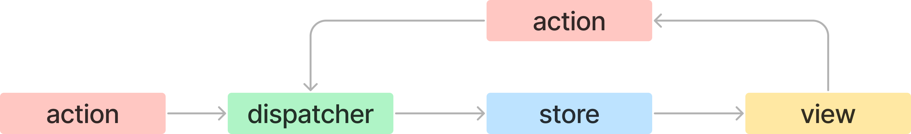

# 상태 관리는 왜 필요한가?
- **상태**
	- 일반적인 웹 애플리케이션에서 어떠한 의미를 가진 값으로 어플리케이션의 시나리오에 따라 지속적으로 변경될 수 있는 값
	- UI, URL, form(loading, submit, disabled, validation 등의 상태를 가짐), 서버에서 가져온 값
	- 어플리케이션 전체적으로 관리해야할 상태가 있을 때, 다음과 같은 요소들을 주의해야 한다.
		- 그 상태에 따라 다양한 요소들이 각 상태에 맞는 UI를 보여줘야 함
		- 상태를 어디에 둘 것인지
		- 상태 변화에 따른 요소들의 변경에 의한 tearing(하나의 상태에 따라 사용자에게 서로 다른 결과물을 보여주는 것)을 어떻게 방지할 것인지

## 리액트 상태 관리의 역사

### Flux 패턴
순수 리액트에서 할 수 있는 전역 상태관리 수단으로 Context API가 떠오르며, 엄밀히 Context API는 상태 주입을 도와주는 역할을 한다. 리덕스 이전까지 리액트 애플리케이션에서 이름을 널리 알린 상태 관리 라이브러리는 없었다.

2014년 Flux 패턴과 이를 기반으로 한 라이브러리 Flux가 등장한다. 웹 애플리케이션이 비대해지고 상태(데이터)도 많아짐에 따라 상태 변화를 추적하고 이해하기 어려웠다. 

페이스북 팀은 문제의 원인을 **양방향 데이터 바인딩**으로 봤다. 기존 MVC 패턴에서는 뷰(HTML)가 모델(Javascript)을 변경할 수 있으며 모델도 뷰를 변경할 수 있어 코드를 작성하기는 쉽지만, 코드의 양이 많아지고 변경 시나리오가 복잡해질수록 관리가 어려워진다. 페이스북 팀은 데이터 흐름을 양방향이 아닌 단방향으로 변경하는 것을 제안하였고, 이것이 Flux 패턴의 시작이다. 

**용어**
- action
	- 어떠한 작업을 처리할 액션과 그 액션 발생 시 함께 포함시킬 데이터를 의미
	- 액션 타입과 데이터를 각각 정의하여 dispatcher로 보냄
- dispatcher
	- 액션을 스토어에 보내는 역할
	- 콜백 함수 형태로, 액션이 정의한 타입과 데이터를 모두 스토어에 보냄
- store
	- 실제 상태에 따른 값과 상태를 변경할 수 있는 메서드를 가지고 있음
	- 액션의 타입에 따라 상태를 변경할지 정의되어 있음
- view
	- 리액트의 컴포넌트에 해당하는 부분
	- 스토어에서 만들어진 데이터를 가져와 화면을 렌더링하는 역할
	- view에서 사용자 입력이나 행위에 따라 상태를 업데이트할 수도 있음



Action의 종류와 필요로하는 데이터를 정의하고, 스토어 역할을 하는 reducer를 useReducer로 넘겨준다. 반환되는 dispatcher로 현재 액션을 실행할  수 있다.

- 사용자의 입력에 따라 데이터를 갱신하고 화면을 업데이트 하는지 코드로 작성해야 하기 때문에 코드의 양이 많아진다.
- 데이터 흐름이 액션이라는 한 방향으로 줄어들어 데이터 흐름을 추적하기 쉽고 코드를 이해하기 쉬워진다.
- 상태와 그 상태의 변경에 대한 흐름과 방식을 단방향으로 채택

### 리덕스
Flux 구조 및 Elm 아키텍처를 도입한 상태관리 라이브러리

> **Elm 아키텍처**
> - Elm: 웹페이지를 선언적으로 작성하기 위한 언어
> Flux와 마찬가지로 데이터 흐름을 세 가지로 분류하고, 이를 단방향으로 강제해 웹 어플리케이션의 상태를 안정적으로 관리하고자 하는 아키텍처

- 리덕스는 하나의 상태 객체를 스토어에 저장해두고, 이 객체를 업데이트하는 작업을 디스패치해 업데이트를 수행한다.
- `reducer` 함수는 웹 애플리케이션 상태에 대한 완전한 새로운 복사본을 반환한 다음, 애플리케이션에 새롭게 만들어진 상태를 전파한다.

**단점**
- 단순히 하나의 상태를 바꾸기 위해서도 액션에 대한 타입, creator, dispatcher, selector 등 작성해야할 보일러플레이트가 많다.

### Context API & useContext
- props drilling 문제, redux 보일러 플레이트 문제는 컴포넌트를 설계할 때 커다란 제약이 되었다.
- Context API는 전역 상태를 하위 컴포넌트에 주입할 수 있는 API로, props로 상태를 넘겨주지 않더라도 Provider가 주입하는 상태를 사용할 수 있도록 한다.
- 즉, Context API는 상태 관리가 아닌 주입을 도와주는 기능이며 렌더링을 막아주는 기능이 없기 때문에 사용할 때 주의가 필요하다. 

### React Query와 SWR
리액트 16.8버전에서 Hook API가 추가되면서 state를 손쉽게 재사용할 수 있게 되었고, 이를 기반으로 React Query와 SWR이 등장하였다.

두 라이브러리 모두 외부에서 데이터를 불러오는 fetch를 관리하는 데 특화된 라이브러리로, API 호출에 대한 상태를 관리하며 HTTP 요청에 특화된 상태 관리 라이브러리이다.

### Recoil, Zustand, Jotai, Valtio
훅을 활용해 상태를 가져오거나 관리할 수 있는 라이브러리들 또한 등장하였다. 이러한 라이브러리들은 peerDependencies로 리액트 16.8 버전 이상을 요구하고 있으며, 훅을 활용해 작은 크기의 상태를 효율적으로 관리한다. 

# 리액트 훅으로 시작하는 상태관리

## 가장 기본적인 방법: useState와 useReducer
`useState`를 기반으로 커스텀 훅을 만들어 여러 컴포넌트에 걸쳐 손쉽게 동일한 인터페이스의 상태를 생성하고 관리할 수 있다. 
```tsx
function useCounter(initCount: number = 0) {
  const [counter, setCounter] = useState(initCount);
  function inc() {
    setCounter(prev => prev + 1);
  }
  return { counter, inc }
}
```

`useReducer` 또한 마찬가지로 지역 상태를 관리할 수 있는 훅으로 `useState`는 `useReducer`의 내부 구현을 사용하여 만들어졌다. 

하지만 이 두 훅은 컴포넌트별로 훅을 사용할 때마다 초기화 되므로 컴포넌트별 상태의 파편화가 일어난다. 따라서 지역 상태만을 관리할 수 있다.

이러한 문제를 해결하는 쉬운 방법은 컴포넌트를 한단계 끌어올리고 props를 통해서 데이터를 내려주는 것인데, 이는 props 형태로 필요한 컴포넌트에 제공해야하기 때문에 여전히 불편하다.

## useState의 상태를 바깥으로 분리하기
`useState`는 리액트가 만든 클로저 내부에서 관리되어 지역 상태로 생성되기 때문에 해당 컴포넌트에서만 사용할 수 있다. 
리액트 클로저가 아닌 다른 자바스크립트 실행 문맥에서 초기화되어 관리될 경우 상태를 참조하는 유효한 스코프 내부에서 해당 객체의 값을 공유해서 사용할 수 있을 것 같다. 하지만 컴포넌트를 리렌더링 시키는 장치가 없다면 제대로 동작하지 않을 것이다.

리렌더링을 위해서는 다음 작업 중 최소 하나는 수행되어야 한다.
- 컴포넌트 렌더링과 관계없는 직접적인 상태관리가 아니더라도 `useState`, `useReducer`의 반환값 중 두번째 인수가 호출된다.
- 부모 함수(부모 컴포넌트)가 리렌더링 되거나 해당 함수가 다시 실행되어야 한다. 

`useState`를 통해 전역 상태를 참조하는 방법을 사용하더라도해당 컴포넌트는 리렌더링 되지만 그 외의 컴포넌트에서 상태 변화에 대한 리렌더링을 수행하지 못한다.

따라서 함수 외부에서 상태를 참조하고 렌더링까지 수행하기 위해서는 다음과 같은 조건을 만족해야 한다.
- 전역에 있어야할 필요는 없지만, 컴포넌트 외부에 상태를 두고 여러 컴포넌트가 같이 사용가능해야 함
- 외부에 있는 상태를 사용하는 컴포넌트는 상태 변화를 알아챌 수 있어야 하고 상태가 변화될 때마다 리렌더링이 일어나서 컴포넌트를 최신 상태값 기준으로 렌더링해야 한다. 이 상태 감지는 상태를 변경시키는 컴포넌트 외에도 해당 상태를 참조하는 모든 컴포넌트에서 동일하게 작동해야함
- 상태가 원시값이 아닌 객체의 경우, 객체에 내가 감지하지 않는 값이 변해도 리렌더링이 발생해서는 안 됨 (`{a:1, b:2}`에서 b만을 참조하는 컴포넌트가 a만 변경시에 리렌더링 되면 안 됨)


## useState와 Context를 동시에 사용하기


## 상태관리 라이브러리 Recoil, Jotai, Zustand 살펴보기
- Recoil과 Jotai는 Context와 Provider, 훅을 기반으로 가능한 작은 상태를 효율적으로 관리하는데 초점을 맞추고 있음
- Zustand는 리덕스와 비슷하게 하나의 큰 스토어를 기반으로 상태를 관리하며, Context가 아니라 스토어가 가지는 클로저를 기반으로 생성됨. 스토어의 상태 변경시 이 상태를 구독하는 컴포넌트에 전파해 리렌더링을 알림.

### Recoil
페이스북에서 만든 리액트를 위한 상태 관리 라이브러리

- `RecoilRoot`
	- 리코일을 사용하기 위해 애플리케이션의 최상단에 선언해 두어야 함
	- `RecoilRoot`로 생성된 Context에 상태값을 저장하기 위한 스토어를 생성
	- 스토어의 상태값에 접근할 수 있는 함수들이 있으며, 이를 활용해 상태값에 접근하거나 상태값을 변경
	- 값의 변경이 발생하면 이를 참조하는 하위 컴포넌트에 알림
- `atom`
	- 상태를 나타내는 최소 단위
	- 다른 atom과 구별하는 식별자인 키값을 필수로 가짐
- `useRecoilValue`
	- atom 값을 읽어오는 훅
- `useRecoilState`
	- `useState`와 유사하게 값을 가져오고 변경할 수 있는 훅
- `selector`
	- 한 개 이상의 atom값을 바탕으로 새로운 값을 조립할 수 있는 API

**특징**
- 다양한 비동기 작업을 지원하는 API를 제공하여 미들웨어를 사용하지 않아도 비동기 작업을 수월하게 처리할 수 있음
- Devtool 제공
- 아직 1.0.0 버전이 릴리즈되지 않았음

### Jotai
Recoil의 atom 모델에 영감을 받아 만들어진 상태관리 라이브러리

상향식(Bottom Up) 접근법을 취하고 있어 하나의 큰 상태를 애플리케이션에 내려주는 것이 아니라 작은 단위의 상태를 위로 전파할 수 있는 구조를 취하고 있음

리렌더링 문제를 해결하며, 최적화를 거치지 않아도 리렌더링이 일어나지 않음

- `atom`
	- 최소 단위의 상태
	- Recoil과 다르게 하나만으로 상태를 만들 수도 있고, 이에 파생된 상태를 만들 수도 있음
- `useAtomValue`
- `useAtom`

**특징**
- Recoil에 영감을 받아 유사한 점이 많으며, Recoil의 한계점을 극복하려고 함
- API가 간결함

### Zustand
Redux에 영감을 받아 만들어진 상태관리 라이브러리
